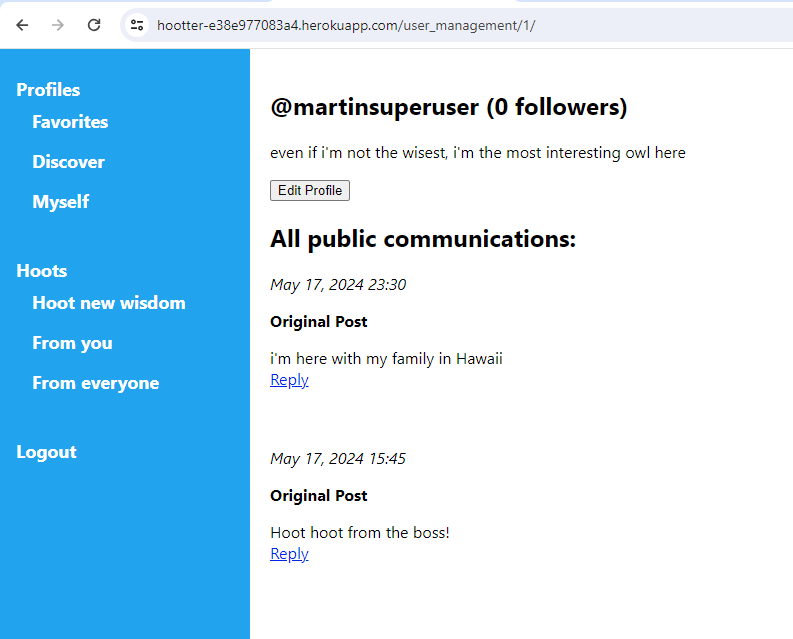

# Hootter(Twitter clone)

## Author's context:
Last week, I published my first homegrown CRUD: [Yindeed](https://github.com/martn2023/yindeed1/blob/master/README.md). The learnings and feedback from mentors has driven the following goals for this project:

## What I built:
>**Overview:** 
Hootter is like a Twitter, but for a wiser crowd (made of owls) to share wisdom.

>* user A can create an "Original Post":
>  * users A or B can "Reply" to Original Post, but not to a Reply
>  * replies from B show up in A's "Feed"
>* user A can subscribe to user B:
>  * in A's Feed, B's Original Posts show up, but not B's replies
>* Feed content is not censored, filtered, prioritized by select authors nor following size. For now, content is only sortable in reverse chronology 

## Live:
A live demo now hosted on <b>Heroku</b> at [https://hootter-e38e977083a4.herokuapp.com/](https://hootter-e38e977083a4.herokuapp.com/)

<b>username</b>: wisebird 
<b>password</b>: verywise

## New technical achievements:
>**PERSISTENT DATA - Postgres:**
Heroku doesn't support persistent data with SQLlite, which drove me towards PostGres. This marks my first PostGres installation ever.

>**MULTIPLE DEVICES:**
Had to install and configure Postgres on a 2nd machine, creating a 2nd database altogether and figuring out git updates

## Potential improvements:
>**NESTED REPLIES:** 
Think of Reddit.com's reply structure 

>**DOWNVOTING:**
  
>**NESTED REPLIES:** 
Think of Reddit.com's reply structure 

>**RECOMMENDATION ENGINE:** 
Feed content would be filtered and prioritized based off a staff-determined scoring system. A further advancement would allow users to customize how this recommendation engine thinks i.e. would it focus on the speaker more than the message content? The topic more than the recency?